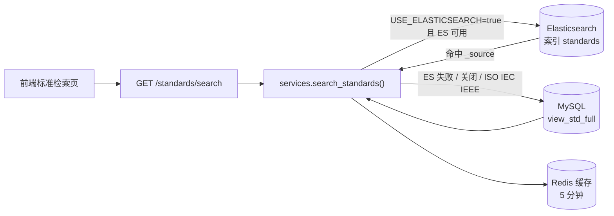

# Elasticsearch 启用指南

本文说明如何在 **std_searpage** 项目中启用 Elasticsearch（以下简称 ES），用于加速**标准检索**（`/api/v1/standards/search`）。

与 [开发者指南.md](./开发者指南.md)、[启动指令.md](../启动指令.md) 配合使用。

---

## 1. 先搞清楚：现在是什么状态

| 层级 | 状态 |
|------|------|
| 代码集成 | 已完成：`search_standards()` 支持 ES 优先 + MySQL 降级 |
| 默认开关 | **关闭**（`USE_ELASTICSEARCH=false`） |
| 索引同步 | 提供 Django 管理命令 `sync_es_index`（见第 5 节） |
| 实际生效范围 | 仅 **GB / HB / DB / TB** 等国内标准检索；**ISO / IEC / IEEE 始终走 MySQL** |

未部署 ES 或未建索引时，**不要**打开开关，否则启动后会尝试连接 ES，失败则自动熔断并回退 MySQL（功能正常，但可能多等一次超时）。

---

## 2. 适用场景

建议在以下情况启用 ES：

- 标准库数据量较大（例如 `view_std_full` 十万级以上）
- `standards/search` 在 MySQL 下响应慢（>1s）
- 需要更好的关键词相关性（标准号加权、中英文名称匹配）

**不必**为以下功能部署 ES：

- 标准详情、演进谱系、文件下载
- 数据分析、起草单位统计
- ISO / IEC / IEEE 检索（代码固定走 MySQL）

---

## 3. 架构与数据流



**熔断机制**（`es_circuit.py`）：

- 启动时后台线程 `ping` ES
- 连续失败或 ping 失败 → 本进程内不再尝试 ES，直接 MySQL
- 单次查询异常 → 冷却 `ES_CIRCUIT_COOLDOWN` 秒（默认 120）后重试

---

## 4. 部署 Elasticsearch

### 4.1 本地开发（Docker，推荐）

在项目根目录或任意目录创建 `docker-compose.es.yml`：

```yaml
services:
  elasticsearch:
    image: docker.elastic.co/elasticsearch/elasticsearch:8.12.0
    container_name: std-searpage-es
    environment:
      - discovery.type=single-node
      - xpack.security.enabled=false
      - ES_JAVA_OPTS=-Xms512m -Xmx512m
    ports:
      - "9200:9200"
    volumes:
      - es_data:/usr/share/elasticsearch/data

volumes:
  es_data:
```

启动：

```powershell
docker compose -f docker-compose.es.yml up -d
```

验证：

```powershell
curl http://127.0.0.1:9200
```

应返回 `"tagline" : "You Know, for Search"` 等信息。

### 4.2 生产环境建议

- 使用独立 ES 集群或云服务，**不要**与 MySQL 同机抢内存
- 开启认证（API Key 或用户名密码），并在 `ES_HOST` 中携带凭证
- 中文检索效果要求高时，安装 **IK 分词插件**（见第 6.2 节）
- 设置 JVM 堆内存为物理内存的 50% 以内（且不超过 32GB）

---

## 5. 建索引与同步数据

### 5.1 环境变量

在后端运行环境中设置（PowerShell 示例）：

```powershell
$env:USE_ELASTICSEARCH = "true"
$env:ES_HOST = "http://127.0.0.1:9200"
$env:ES_INDEX = "standards"
$env:ES_REQUEST_TIMEOUT = "2"
$env:ES_CIRCUIT_COOLDOWN = "120"
$env:ES_CIRCUIT_MAX_FAILURES = "2"
```

或在 `backend/.env` / 系统环境变量中持久化（需自行加载到 Django，当前 `settings.py` 已读取上述变量）。

### 5.2 执行同步命令

项目提供管理命令，从 MySQL 宽表 `view_std_full` 全量写入 ES：

```powershell
cd backend
.\venv\Scripts\activate

# 创建索引（若不存在）并全量同步
python manage.py sync_es_index

# 删除旧索引后重建（ mapping 变更时使用）
python manage.py sync_es_index --recreate

# 指定批量大小
python manage.py sync_es_index --batch-size 1000
```

同步完成后可检查文档数：

```powershell
curl "http://127.0.0.1:9200/standards/_count"
```

### 5.3 索引字段说明

ES 文档字段与列表 API 返回字段一致（`SEARCH_LIST_FIELDS`）：

| 字段 | ES 类型 | 检索用途 |
|------|---------|----------|
| `id` | long | 主键 |
| `std_id` | text + keyword | 关键词匹配，权重 ×3 |
| `std_type` | text + keyword | 筛选 `term std_type.keyword` |
| `std_type_no` | keyword | 备用 |
| `std_chinesename` | text | 关键词匹配，权重 ×2 |
| `std_englishname` | text | 关键词匹配 |
| `release_date` | date | 展示 |
| `implement_date` | date | 展示 |
| `ex_state` | integer | 筛选 `term ex_state` |
| `create_time` | date | 展示 |

**数据源**：`view_std_full`（`ViewStdFull` 模型，`managed=False`）。

---

## 6. 启动后端并验证

### 6.1 启动

```powershell
cd backend
$env:USE_ELASTICSEARCH = "true"
python manage.py runserver 8001
```

日志中应出现：

```
Elasticsearch is available.
```

若出现 `Elasticsearch disabled` 或 `probe failed`，说明开关未开或 ES 不可达。

### 6.2 接口验证

登录后携带 JWT 请求：

```http
GET /api/v1/standards/search?keyword=GB/T&std_type=GB&page=1&size=10
Authorization: Bearer <access_token>
```

对比 ES 开启前后响应时间；结果字段应与 MySQL 降级时一致。

### 6.3 确认是否走了 ES

- 后端日志无 `Elasticsearch Search failed, fallback to MySQL`
- 直接查 ES：

```powershell
curl -X POST "http://127.0.0.1:9200/standards/_search" -H "Content-Type: application/json" -d "{\"query\":{\"match\":{\"std_chinesename\":\"安全\"}},\"size\":3}"
```

---

## 7. 查询逻辑（与代码一致）

代码位置：`backend/standard_app/services.py` → `search_standards()`

| 条件 | ES 查询 |
|------|---------|
| 有 `keyword` | `multi_match`：`std_id^3`、`std_chinesename^2`、`std_englishname` |
| 有 `std_type` | `term` on `std_type.keyword`（IEEE 有特殊 bool 规则） |
| 有 `status`（ex_state） | `term` on `ex_state` |
| 无条件 | `match_all` |

**不走 ES 的情况：**

- `USE_ELASTICSEARCH=false`
- ES 熔断中或 ping 失败
- `std_type` 为 ISO / IEC / IEEE

**缓存**：相同参数 5 分钟内命中 Redis（`std_search:v1:...`），改 ES 数据后可能有短暂延迟，重启 Redis 或等待 TTL 过期。

---

## 8. 数据更新策略

当前**没有**自动增量同步。MySQL 数据变更后，需定期或手动重建索引：

| 策略 | 做法 |
|------|------|
| 手动全量 | 定时任务执行 `python manage.py sync_es_index` |
| 重建 mapping | `python manage.py sync_es_index --recreate` |
| 增量（需自行扩展） | 监听入库脚本 / Celery 任务，对单条文档 `index` / `delete` |

建议：

- 日更库：每日凌晨全量或增量同步
- 实时性要求高：在数据入库流程中增加 ES 写入（项目尚未内置）

---

## 9. 中文分词（可选优化）

默认 mapping 使用 ES 内置 `standard` 分词器，对**标准号**足够，对**中文名称**效果一般。

生产环境可安装 IK 插件后，修改 `sync_es_index` 中的 mapping，将 `std_chinesename` 改为：

```json
"std_chinesename": {
  "type": "text",
  "analyzer": "ik_max_word",
  "search_analyzer": "ik_smart"
}
```

然后 `--recreate` 重建索引。

IK 安装（ES 8 容器内示例）：

```bash
docker exec -it std-searpage-es elasticsearch-plugin install \
  https://get.infini.cloud/elasticsearch/analysis-ik/8.12.0
docker restart std-searpage-es
```

---

## 10. 环境变量一览

| 变量 | 默认值 | 说明 |
|------|--------|------|
| `USE_ELASTICSEARCH` | `false` | 是否启用 ES |
| `ES_HOST` | `http://127.0.0.1:9200` | ES 地址 |
| `ES_INDEX` | `standards` | 索引名 |
| `ES_REQUEST_TIMEOUT` | `2` | 单次查询超时（秒） |
| `ES_CIRCUIT_COOLDOWN` | `120` | 失败后冷却时间（秒） |
| `ES_CIRCUIT_MAX_FAILURES` | `2` | 连续失败次数后永久跳过（本进程内） |

---

## 11. 常见问题

### Q1：开了 `USE_ELASTICSEARCH=true` 但搜索还是很慢

1. 看日志是否 `fallback to MySQL`（索引空、mapping 不对、ES 挂了）
2. 执行 `curl http://127.0.0.1:9200/standards/_count` 确认有数据
3. 检查 Redis 是否可用（缓存 miss 时会打 ES/MySQL）

### Q2：ES 有结果但和 MySQL 不一致

- 索引未同步最新数据 → 重新 `sync_es_index`
- 查的是 ISO/IEC/IEEE → 本来就走 MySQL，与 ES 无关

### Q3：未部署 ES 要不要改配置？

**不用。** 保持默认 `USE_ELASTICSEARCH=false` 即可，全程 MySQL。

### Q4：如何临时关闭 ES

```powershell
$env:USE_ELASTICSEARCH = "false"
```

重启 Django 进程。无需删索引。

---

## 12. 相关代码文件

| 文件 | 作用 |
|------|------|
| `backend/config/settings.py` | ES 环境变量 |
| `backend/standard_app/services.py` | 搜索入口、ES 查询体 |
| `backend/standard_app/es_circuit.py` | 熔断与探测 |
| `backend/standard_app/apps.py` | 启动时后台 probe |
| `backend/standard_app/crud.py` | MySQL 降级查询、`SEARCH_LIST_FIELDS` |
| `backend/standard_app/management/commands/sync_es_index.py` | 全量同步命令 |

---

## 13. 启用检查清单

- [ ] ES 服务已启动，`curl ES_HOST` 正常
- [ ] 已执行 `python manage.py sync_es_index`，`_count` 与 `view_std_full` 量级接近
- [ ] `USE_ELASTICSEARCH=true` 且已重启后端
- [ ] 日志出现 `Elasticsearch is available.`
- [ ] 前端标准检索返回正常，无明显 `fallback to MySQL` 告警
- [ ] 已规划数据更新后的索引同步方式
