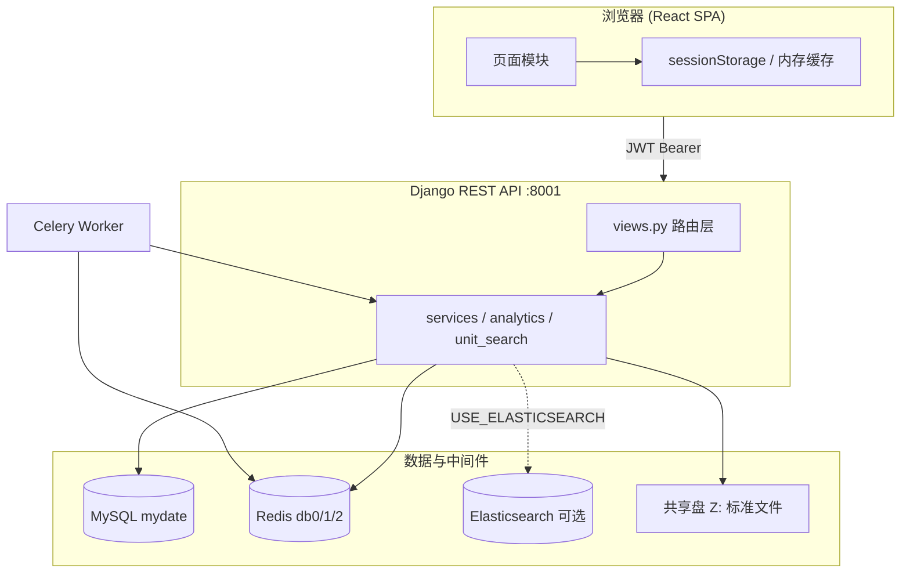
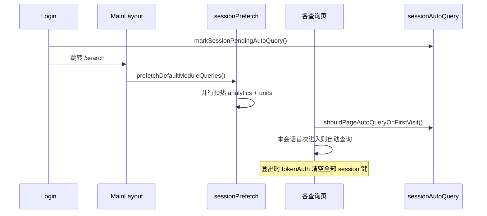

# 开发者指南

本文档面向后续参与 **std_searpage（标准检索与分析平台）** 开发的工程师，说明项目架构、目录结构、核心流程、API 约定与扩展方式。  
与 [启动指令.md](../启动指令.md)、[Redis配置指南.md](../Redis配置指南.md)、[Elasticsearch启用指南.md](./Elasticsearch启用指南.md) 配合使用。

---

## 1. 项目概述

### 1.1 业务目标

系统围绕**标准文献库**提供：

- 标准检索与详情查看（含替代关系、演进谱系）
- 按行政区划 / 标准类别的**数据分析**（表格、图表、年度对比、年段统计）
- **起草单位**多维度查询（排位、首家牵头、首次参与）
- 可选 AI 能力（规范性引用解析、合规性评价，依赖 Celery + Dify）

### 1.2 架构总览



### 1.3 设计原则（当前代码中的共识）

1. **数据库只读映射**：业务表多为 `managed = False`，对接既有 MySQL 库，**不要用 Django migrate 改表结构**。
2. **登录后会话体验**：登录后各查询页默认条件自动查一次；MainLayout 挂载时并行预热数据分析 / 起草单位；登出清空 session 缓存。
3. **先快后全**：大查询支持 `skip_count`、`include_breakdown=0`、`include_analysis=0` 等参数，先出首屏再补全。
4. **Redis 可选降级**：analytics 有进程内缓存兜底；ES 有熔断器，不可用时走 MySQL。

---

## 2. 目录结构

```
std_searpage/
├── README.md                 # 项目入口与文档索引
├── 启动指令.md
├── Redis配置指南.md
├── 标准谱系全链路逻辑方案.md
├── docs/
│   └── 开发者指南.md         # 本文档
├── backend/
│   ├── config/               # Django 项目配置
│   │   ├── settings.py
│   │   ├── urls.py           # /admin + /api/v1
│   │   └── celery.py
│   ├── standard_app/         # 唯一业务 App
│   │   ├── models.py         # ORM 映射（mostly unmanaged）
│   │   ├── views.py          # DRF API 视图
│   │   ├── urls.py           # API 路由
│   │   ├── services.py       # 检索、详情、谱系、文件
│   │   ├── analytics.py      # 数据分析
│   │   ├── unit_search.py    # 起草单位
│   │   ├── crud.py           # 底层 SQL 查询
│   │   ├── file_storage.py   # 共享盘文件
│   │   ├── es_circuit.py     # ES 熔断
│   │   └── tasks.py          # Celery 任务
│   ├── manage.py
│   └── requirements.txt
└── frontend/
    ├── src/
    │   ├── App.jsx             # 路由
    │   ├── layouts/            # MainLayout
    │   ├── pages/              # 业务页面
    │   ├── components/         # 通用 UI、详情组件
    │   ├── api/                # axios 封装与接口
    │   └── utils/              # 会话、预取、类型工具
    ├── vite.config.js
    └── package.json
```

---

## 3. 环境准备与启动

### 3.1 依赖服务

| 服务 | 用途 | 默认 |
|------|------|------|
| MySQL | 主数据 | 库名 `mydate`，端口 3306 |
| Redis | Celery + Django Cache | 6379，db0/1/2 |
| Node.js | 前端构建 | 18+ |
| Python | 后端 | 3.10+ |

Elasticsearch、Celery Worker **仅在需要 ES 检索或 AI 功能时**启动。启用 ES 步骤见 [Elasticsearch启用指南.md](./Elasticsearch启用指南.md)。

### 3.2 配置要点

**前端** `frontend/.env.development`：

```env
VITE_API_BASE=http://127.0.0.1:8001/api/v1
```

生产构建需 `frontend/.env.production`，`VITE_API_BASE` 指向服务器 API 地址。

**后端** `backend/config/settings.py`（当前多为硬编码，部署时需改）：

- `DATABASES` — MySQL 连接
- `CELERY_BROKER_URL` / `CACHES` — Redis 地址
- `SHARED_DISK_DIR` — 标准 PDF/Word 共享目录
- 环境变量：`USE_ELASTICSEARCH`、`ES_HOST` 等

### 3.3 启动命令

见 [启动指令.md](../启动指令.md)。摘要：

```powershell
# 后端
cd backend && .\venv\Scripts\activate && python manage.py runserver 8001

# 前端
cd frontend && npm run dev

# Celery（AI 功能）
celery -A config worker -l info
```

默认账号：`admin` / `adminpassword`

---

## 4. 后端开发

### 4.1 技术栈

- Django 4.2.x、DRF、djangorestframework-simplejwt
- PyMySQL、Redis、Celery、openpyxl（Excel 导出）
- elasticsearch（可选）

### 4.2 路由与前缀

- 根：`/api/v1/` → `standard_app.urls`
- 除登录/自助注册外，业务接口均需 **JWT**：`Authorization: Bearer <token>`

### 4.3 API 一览

#### 认证

| 方法 | 路径 | 说明 |
|------|------|------|
| POST | `/auth/login` | 登录，返回 access + refresh |
| POST | `/auth/refresh` | 刷新 token |
| POST | `/auth/register` | 超管创建用户 |
| POST | `/auth/self-register` | 用户自助注册（仅用户名） |

#### 标准检索与详情

| 方法 | 路径 | 说明 |
|------|------|------|
| GET | `/standards/search` | 检索列表 |
| GET | `/standards/<path:std_id>/` | 详情（含谱系、替代史） |
| GET | `/standards/<path:std_id>/file-status` | 文件是否可下载 |
| GET | `/standards/<path:std_id>/download` | 下载源文件 |

**检索常用 query 参数：**

- `keyword`、`std_type`、`status`（实施状态 ex_state）
- `page`、`size`
- `skip_count=1` — 跳过 COUNT，加快首屏（total 可能为 -1，前端需二次补全）

#### 数据分析

| 方法 | 路径 | 说明 |
|------|------|------|
| GET | `/analytics/regions` | 省 / 市 / 县列表 + `latest_year` |
| GET | `/analytics/summary` | 区域汇总 |
| GET | `/analytics/year-compare` | 两年对比（`year_a`, `year_b`） |
| GET | `/analytics/year-range` | 年段统计（`year_from`, `year_to`） |
| GET | `/analytics/export` | 导出 Excel |

**区域参数（summary / export）：**

- `year` — 筛选发布年份
- `std_scope` — `00,01,02,03` 或 `GB,HB,DB,TB`（可逗号分隔）
- `province`、`city`、`county`
- `include_breakdown=0` — 仅返回合计，跳过分省/市/县明细（快路径）

**注意：** `year-compare` / `year-range` **不要**传 `year` 参数，只用 `year_a/year_b` 或 `year_from/year_to`。区划与类别通过 `_region_scope_params` 传递。

#### 起草单位

| 方法 | 路径 | 说明 |
|------|------|------|
| GET | `/units/search` | 排位检索 |
| GET | `/units/export` | 导出 Excel |
| GET | `/units/first-lead` | 历史首家牵头国标 |
| GET | `/units/first-participation` | 单位首次参与（分页） |
| GET | `/units/<path:std_id>/drafters` | 某标准起草单位详情 |

**常用参数：**

- `year`、`rank_query`（如 `1`、`2-4`、`>=4`）
- `std_scope`、`province`、`city`、`county`
- `include_analysis=0` — 列表页跳过统计分析（快路径）
- `page`、`size`

#### AI 任务（可选）

| 方法 | 路径 | 说明 |
|------|------|------|
| POST | `/ai/parse-references` | 提交引用解析 |
| POST | `/ai/compliance-evaluation` | 提交合规评价 |
| GET | `/tasks/<task_id>/status` | 轮询任务状态 |

### 4.4 核心模块说明

#### `services.py`

- `search_standards()` — ES 优先，熔断后 MySQL；ISO/IEC/IEEE 固定走 MySQL
- `get_full_standard_detail()` — 聚合 base、分类详情、起草单位、谱系、替代关系
- 谱系：`ped_chain` JSON  enrichment（替代类型颜色、节点是否可打开详情）

#### `analytics.py`

- `regional_summary()` — 按区划层级自动 breakdown（全国→省，省→市，市→县）
- `year_compare()` / `year_range_stats()` — 年度分析
- 缓存键前缀：`summary:`、`yrcmp:`、`yrrng:` 等，版本号见代码 `_cache_key` 的 `v5`
- 双层缓存：Redis + 进程内 dict（Redis 不可用仍可短期命中）

#### `unit_search.py`

- 从 `std_unit_relation` 出发 JOIN `std_base`，支持排位 DSL
- 缓存键：`drafter_rank_search:v8:...` 等

#### `models.py`

所有模型映射既有表，**`managed = False`**。核心视图：

- `ViewStdFull` — 检索与分析的主视图
- `StdPedChain` — 预计算谱系 JSON
- `StdReplace` — 替代关系

### 4.5 统一响应格式

```json
{
  "code": 0,
  "message": "success",
  "data": { ... }
}
```

`code !== 0` 时前端 axios 拦截器会 reject 并展示 `message`。

---

## 5. 前端开发

### 5.1 技术栈

- React 19、React Router 7、Vite 8
- Ant Design 6、Tailwind CSS 4
- ECharts（分析图表）、D3（演进谱系图）
- Axios

### 5.2 路由

| 路径 | 组件 | 说明 |
|------|------|------|
| `/login` | `Login.jsx` | 公开 |
| `/search` | `StandardSearch` | 默认首页 |
| `/analytics` | `DataAnalysis` | 数据分析 |
| `/units` | `DraftingUnit` | 起草单位（多 Tab） |
| `/units/stats` | `DraftingUnit/Stats` | 单位统计 |
| `/detail/:std_id` | `DetailPage` | 标准详情 |
| `/register` | `Register.jsx` | 超管开户 |

布局：`MainLayout`（Sidebar + Header + 移动端底栏）。

### 5.3 API 层

- `api/axios.js` — 基址、`{code,data}` 解包、401 自动 refresh
- `api/tokenAuth.js` — 登录态、登出清理、刷新策略
- `api/standards.js`、`analytics.js`、`units.js` — 业务接口

### 5.4 会话与缓存机制（重要）

登录后的体验由以下模块协同完成，**改查询逻辑前务必理解**：



| 模块 | 文件 | 作用 |
|------|------|------|
| 自动查询 | `utils/sessionAutoQuery.js` | 每页本会话只自动查一次 |
| 后台预热 | `utils/sessionPrefetch.js` | 登录后预拉分析/起草单位默认结果 |
| 登录清理 | `api/tokenAuth.js` | `prepareSessionForFreshLogin()` / `clearAuthTokens()` |
| 分析页缓存 | `pages/DataAnalysis/analyticsSessionCache.js` | 区划 key + 页面 snapshot |
| 检索列表缓存 | `api/standards.js` | `standard_search_list:*` |
| 起草单位快照 | `DraftingUnit/index.jsx` | `drafting-unit-page-snapshot:v2` |

**登出后禁止写回缓存**：使用 `canPersistSessionData()` 判断。

### 5.5 共享 UI 组件

| 组件 | 路径 | 说明 |
|------|------|------|
| `PageHeader` | `components/ui/PageHeader.jsx` | 页标题，支持 `compact` |
| `FilterPanel` | `components/ui/FilterPanel.jsx` | 筛选区，支持 `compact`、底部一行布局 |
| `EmptyState` / `LoadingPanel` | `components/ui/` | 空态与加载 |
| `ChartCard` | `components/ui/ChartCard.jsx` | 图表容器 |
| `EvolutionGraph` | `components/Detail/EvolutionGraph.jsx` | D3 演进树 |

---

## 6. 功能模块详解

### 6.1 标准检索 (`StandardSearch`)

**前端：** `frontend/src/pages/StandardSearch/`

- URL 与筛选条件同步
- 登录后自动用默认条件查询
- `skip_count` 快路径 + 后台补 total（`totalPending` / 「统计中…」）
- 列表 session 缓存，避免 Tab 切回重复请求

**后端：** `StandardSearchView` → `services.search_standards()`

### 6.2 标准详情与演进图 (`DetailPage`)

**前端：**

- `EvolutionGraph.jsx` — D3 树布局，节点标签、悬停卡片、当前标准高亮
- `ReplaceHistoryTimeline.jsx` — 替代时间线
- 详情 session 缓存，从列表预取

**后端：**

- `get_full_standard_detail()` 返回 `ped_chain`、`replace_history`
- 边颜色：`replace_type` → `完全代替/部分代替/部分代完`（见 `services._map_replace_type_meta`）

谱系设计详见 [标准谱系全链路逻辑方案.md](../标准谱系全链路逻辑方案.md)。

### 6.3 数据分析 (`DataAnalysis`)

**前端：** `frontend/src/pages/DataAnalysis/`

- 筛选：省 / 市 / 县、年份、标准类别（多选 GB/HB/DB/TB）
- 结果 Tab：数据表格、柱状图、饼图、**年度分析**
- `YearAnalysisPanel.jsx`：
  - **两年对比** — 类别增减、柱状/饼图
  - **年段统计** — 段内合计、年度趋势、堆叠图、**各年占比饼图**（按年份分片，非类别）
- 两阶段加载：先 `include_breakdown=0` 合计，再自动拉分省明细

**后端：** `analytics.py`

- `year_range_stats()` 返回 `by_year`、`by_type`、`items`（类别×年份矩阵）

### 6.4 起草单位查询 (`DraftingUnit`)

**前端：** 三个 Tab

1. **起草单位查询** — 年份、排位、类别、区划
2. **历史首家牵头国标** — 按区划查首家牵头
3. **单位首次参与** — 分页列表

**后端：** `unit_search.py`

- `parse_rank_filter()` 解析排位表达式
- `include_analysis=0` 用于列表快路径

### 6.5 用户与权限

- JWT access + refresh，前端提前 60s 刷新
- `CustomUser` 角色：`superadmin` / `user`
- 超管可见「用户分配」入口（`/register`）

---

## 7. 缓存键参考

> 版本号以**源码为准**，[Redis配置指南.md](../Redis配置指南.md) 可能滞后。

### 7.1 后端 Redis（db 2）

| 键模式 | TTL | 模块 |
|--------|-----|------|
| `std_search:v1:...` | 300s | 标准检索 |
| `summary:v5:...` / `yrcmp:v5:...` / `yrrng:v5:...` | 600s | 数据分析 |
| `drafter_rank_search:v8:...` | 600s | 起草单位列表 |
| `first_lead:v2:...` | 600s | 首家牵头 |
| `first_part:v2:...` | 900s | 首次参与 |

### 7.2 前端 sessionStorage

| 键 | 用途 |
|----|------|
| `analytics_page_snapshot:v1` | 数据分析页状态 |
| `drafting-unit-page-snapshot:v2` | 起草单位页状态 |
| `standard_search_list:*` | 检索结果 |
| `standard_detail_cache_*` | 详情预取 |
| `app-pending-auto-query` | 登录待自动查询标记 |
| `app-auto-query-done:{page}` | 各页是否已自动查询 |

---

## 8. 部署与排错

### 8.1 生产检查清单

- [ ] `frontend/.env.production` 中 `VITE_API_BASE` 指向生产 API
- [ ] MySQL / Redis 地址改为内网 IP，非 `127.0.0.1`（若分机部署）
- [ ] 未部署 ES 时 `USE_ELASTICSEARCH=false`
- [ ] 共享盘 `SHARED_DISK_DIR` 在服务器可访问
- [ ] `DEBUG=False`、`SECRET_KEY` 更换（当前 settings 仍适合开发）

### 8.2 「登录很慢」

多为登录后**自动检索**慢，而非 auth 慢。Network 面板区分：

- `auth/login` 慢 → 数据库连接
- `standards/search` / `analytics/summary` 慢 → 数据量 / 缺 Redis / 未走快路径

见 [启动指令.md §6](../启动指令.md)。

### 8.3 年度对比 / 年段统计 500

若报错 `unexpected keyword argument 'year'`：说明把 summary 的 `year` 传给了 compare/range 接口。前端应使用 `scopeParams`（无 year），后端用 `_region_scope_params()`。

---

## 9. 扩展开发指引

### 9.1 新增 API 接口

1. 在 `standard_app/` 实现业务函数（或扩展现有 service）
2. 在 `views.py` 添加 `APIView`，`permission_classes = [IsAuthenticated]`
3. 注册 `urls.py`
4. 在 `frontend/src/api/` 增加方法
5. 页面调用；若需登录预热，考虑扩展 `sessionPrefetch.js` 与 `sessionAutoQuery.js`

### 9.2 新增前端页面

1. 在 `pages/` 创建组件
2. `App.jsx` 注册路由
3. `config/nav.js` 增加导航项
4. 使用 `FilterPanel compact` + `PageHeader compact` 保持布局一致
5. 若需会话恢复，设计 snapshot 结构并在登出时清理

### 9.3 修改数据分析图表

- 数据形状：`chartData.js` 的 `buildSummaryChartOptions` / `buildYearRangeChartOptions`
- 渲染：`components/AnalyticsCharts.jsx`
- 年段饼图按**年份**分片时使用 `sortPieData(..., 'year')`

### 9.4 修改筛选区样式

- 通用：`components/ui/FilterPanel.jsx`（`compact` 模式）
- 年度分析专用：`YearAnalysisPanel.jsx` 内 `YearFilterBar`

### 9.5 数据库变更

ORM 模型为只读映射时：

- 在 MySQL 侧改表 / 视图
- 同步更新 `models.py` 字段
- **不要**依赖 `migrate` 改生产表

---

## 10. 已知遗留与技术债

| 项 | 说明 |
|----|------|
| `SearchPage_old.jsx` | 旧检索页，可清理 |
| 重复 `DetailPage/index.jsx` | 与 `DetailPage.jsx` 并存，需确认引用 |
| `AdminLayout.jsx` | 未使用，主布局为 `MainLayout` |
| `settings.py` 敏感信息 | SECRET_KEY、DB 密码硬编码，生产需外置 |
| `file-status` 偶发 500 | 线程池 shutdown 等问题，待排查 |
| 文档版本号 | `Redis配置指南.md` 缓存版本可能与代码不一致，以源码为准 |

---

## 11. 相关文档

| 文档 | 路径 |
|------|------|
| 启动与排错 | [启动指令.md](../启动指令.md) |
| Redis / Celery | [Redis配置指南.md](../Redis配置指南.md) |
| 谱系逻辑 | [标准谱系全链路逻辑方案.md](../标准谱系全链路逻辑方案.md) |
| 后端 API 补充 | `backend/后端md文档/后端API接口文档.md` |
| 后端架构 | `backend/后端md文档/API与架构设计文档.md` |
| 前端接口说明 | `frontend/前端md文档/前端接口与逻辑文档.md` |

---

## 12. 联系人 / 交接建议

新开发者建议按以下顺序熟悉代码：

1. 跑通 [启动指令.md](../启动指令.md)，登录并走一遍四个主模块
2. 读 `App.jsx`、`MainLayout.jsx`、`api/axios.js`、`api/tokenAuth.js`
3. 读 `services.search_standards` 与 `StandardSearch/index.jsx`（理解检索主路径）
4. 读 `sessionAutoQuery.js` + `sessionPrefetch.js`（理解登录后行为）
5. 按任务深入 `analytics.py` 或 `unit_search.py` 或 `EvolutionGraph.jsx`

如有模块负责人或需求文档，可在本节补充团队内部联系方式。

---

*文档版本：2026-05，与当前主分支功能对齐（含年度分析、会话预热、紧凑筛选布局）。*
